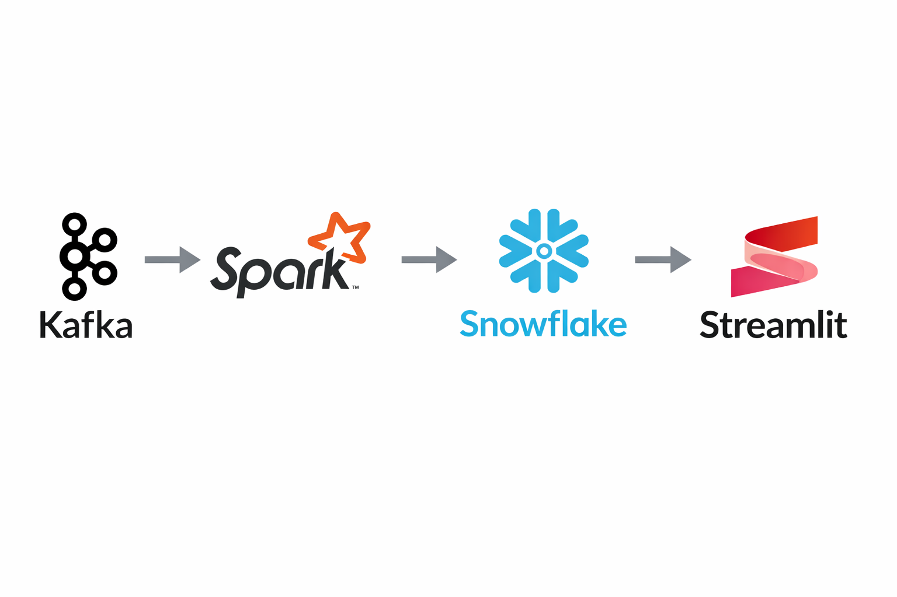

# Real-Time Weather Data Engineering Pipeline

## Overview
This project demonstrates an end-to-end real-time data engineering pipeline using modern tools.

## Tech Stack
- Kafka
- PySpark
- Snowflake
- Streamlit

## Architecture

## Features
- Real-time weather data ingestion
- Stream processing using Spark
- Data warehouse using Snowflake (Bronze → Silver → Gold)
- Interactive dashboard using Streamlit

## Dashboard

## How to Run
1. Start Kafka
2. Run Producer
3. Run Spark Streaming Job
4. Load data into Snowflake
5. Run Streamlit dashboard

## Key Learnings
- Streaming architecture
- Data pipeline design
- Snowflake integration
- Dashboard building
